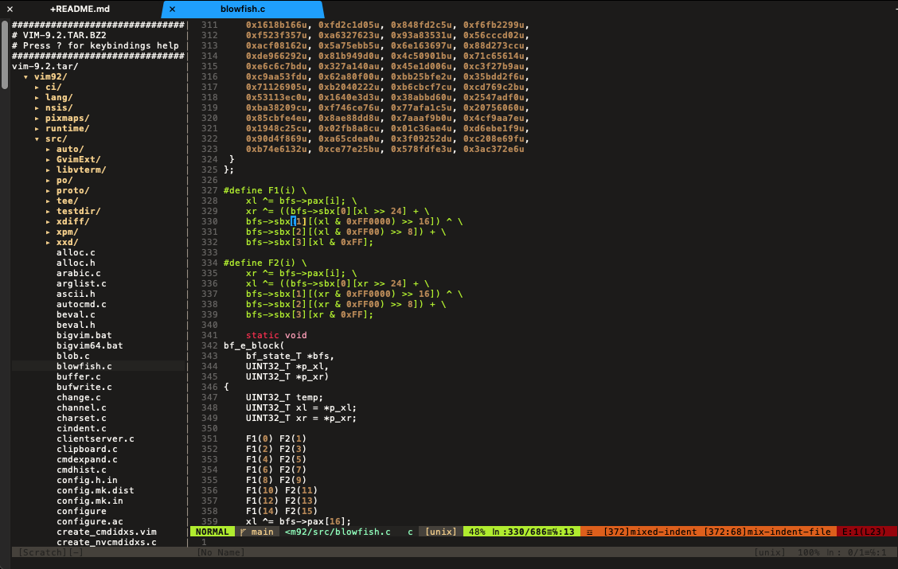

# TarTree {#tartree}

A simple tree browser to view/edit files within a tar archive.
<!-- vimdoc-ignore-start -->


<!-- vimdoc-ignore-end -->

# Requirements {#requirements}

TarTree was written in vim9script and thus depends on Vim 9. Built and tested on Vim 9.2.

# Installation {#installation}

Use your favorite plugin manager

## Examples {#installation-examples}

### Vundle {#installation-vundle}

Add this to your .vimrc

```vim
Plugin 'Galvarcus/TarTree'
```
Then run `:PluginInstall`

### Vim-Plug {#installation-vim-plug}

Add this to your .vimrc

```vim
Plug 'Galvarcus/TarTree'
```

Then run `:PlugInstall`

# Commands {#commands}

`:TarTree PATH_TO_TAR_FILE`

Opens the tarfile in a tree view split similar to Netrw or NERDTree with the following command options:

- ?
  - opens/closes help text view
- o, <CR>
  - opens the current selected file or toggles a directory
- r
  - refreshes the tree
- q
  - quits the tree

`:TarTreeToggle`

Toggles on/off the tree view

`:TarTreeClose`

Closes the TarTree pane

# Global Variables {#global-variables}

To customize TarTree, set the following global variables in your `~/vimrc` prefixed with `let ` for legacy .vimrc. 

`g:tartree_win_width`{#g:tartree_win_width}

Sets the width of the TarTree vsplit
Default: 31

`g:tartree_show_hidden`{#g:tartree_show_hidden}

- 1 to list dot files
- 0 (default) to hide dot files

`g:tartree_arrow_open`{#g:tartree_arrow_open}

Character to display next to open directories, e.g. '-'
Default: '▾ '

`g:tartree_arrow_closed`{#g:tartree_arrow_closed}

Character to display next to closed directories, e.g. '+'
 Default: '▸ '

`g:tartree_auto_open`{#g:tartree_auto_open}

Option to enable TarTree to list a tar file opened with `:e` 

- 1 to enable
- 0 (default) to disable

`g:tartree_tar_cmd`{#g:tartree_tar_cmd}

Tar executable full path or command in your $PATH. Defaults to 'tar'

<!-- vimdoc-ignore-start -->
# Caveats {#caveats}

BSD tar does not support `--delete` and will not allow for editing of files in the archive.

## Windows/Cygwin {#windows-cygwin}

All efforts have been made to account for Windows-centric commands; however, I do not have access to Windows for testing and I am sure something was missed. You can help by testing and submitting an issue here.

# Motivation {#motivation}

TarTree was initially part of another niche vim9script project. About halfway through I decided to branch this component off for use by others. And, as with most other small projects throughout my career, morphed into a bit more than originally intended.

# Acknowledgements {#acknowledgements}

The following have either directly or indirectly inspired this project.

## [NERDTree](https://github.com/preservim/nerdtree)

My personal favorite vim directory browser. Only second to my favorite CLI directory browser [Midnight Commander](https://midnight-commander.org/)

## [Vim's internal tar plugin](https://github.com/vim/vim/blob/master/runtime/autoload/tar.vim)

`autoload/tartree/tartreeRW.vim` is a partial refactoring of the tar.vim, particularly `tar#Read()` and `tar#Write`.
`autoload/tartree.vim` is a reimagining of `tar#Browse()` and `tar#BrowseSelect()`

<!-- vimdoc-ignore-end -->
